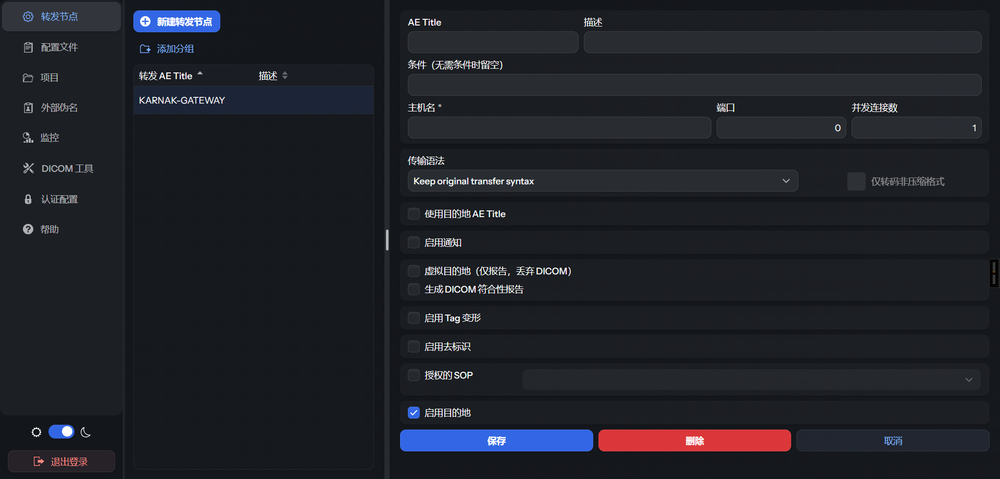

# Karnak 产品与使用介绍

本说明介绍的是基于开源 Karnak 定制的 **Windows 便携版**：中文管理界面、单机开箱即用，供下载解压后直接使用。

**项目地址：** <https://github.com/fightroad/karnak>

Karnak 是开源 **DICOM 网关**，用于医学影像的**去标识（脱敏）**、**Tag 变形**与**符合性检查**。它部署在影像网络与目标归档之间：接收设备 / PACS / 工作站发来的检查，按可配置的配置文件处理后，再转发到一个或多个目的地（DICOM C-STORE 或 DICOMweb STOW-RS）。配置与监控均通过 **Web 管理界面**完成。

---

## 1. 产品定位

| 角色 | 说明 |
|------|------|
| 接收端 | 作为一个 DICOM AE（如 `KARNAK-GATEWAY`）接收 C-STORE |
| 处理端 | 按目的地启用过滤、去标识配置文件、Tag 变形、像素遮罩等 |
| 发送端 | 将处理后的影像转发到院内 PACS 或院外研究库（建议 HTTPS STOW-RS） |
| 运维端 | Web 界面配置节点 / 配置文件 / 项目，并在「监控」中查看传输情况 |

典型场景：医院内设备把影像发到 Karnak，Karnak 去标识后推到院外研究库或合作机构，避免原始患者标识外泄。

数据流概括：多来源 DICOM → Karnak（过滤 / 去标识 / Tag 变形 / 可选符合性检查）→ 一个或多个目的地。

---

## 2. 部署方式

常见用法：

- **院内**：设备、PACS、工作站用 DICOM C-STORE 发到 Karnak 的转发节点（AE Title + 端口）。
- **跨边界**：Karnak 用 **DICOMweb STOW-RS + HTTPS** 发到院外研究库（TLS、认证、只需出站 HTTPS，不必对公网开放 DICOM 端口）。
- **院内研究 PACS**：仍可用普通 C-STORE；同一转发节点上可同时配置多种目的地。

本版本对外提供 **Windows 便携包**（见第 5 节）：解压后运行即可，无需自行搭建数据库等外部服务。

---

## 3. 核心概念（对应左侧菜单）

| 菜单 | 含义 |
|------|------|
| **转发节点** | 对外暴露的 DICOM 监听身份（AE Title）。可配置允许的**源**，以及一个或多个**目的地** |
| **配置文件** | 去标识或 Tag 变形的规则流水线（YAML），可导入 / 导出 / 在界面编辑 |
| **项目** | 承载伪名用的密钥；目的地可关联项目以做确定性伪名 |
| **外部伪名** | 自行维护「患者 ↔ 伪名」映射（界面录入或 CSV），便携版缓存在内存中 |
| **监控** | 按目的地 / 检查 / 序列查看传输计数、错误、已排除、重试等 |
| **DICOM 工具** | C-ECHO、工作列表查询、DICOMweb 探测等 |
| **认证配置** | 目的地（如 STOW）所需的认证信息 |

### 处理流水线（每个目的地各走一遍）

1. **源校验**：若配置了源，仅允许名单内 AE（及可选主机名）
2. **过滤**：按 SOP Class、DICOM Tag 条件表达式跳过不匹配的实例
3. **配置文件**：去标识（含日期偏移、UID 重映射、伪名等）或仅 Tag 变形
4. **像素处理**（可选）：烧录文字遮罩、头颅去面容；自动 OCR 需另外部署服务且默认关闭
5. **传输语法**：可按目的地转码
6. **发送与报告**：C-STORE / STOW-RS；结果进监控，可选邮件通知与符合性报告

---

## 4. 界面导览

下图为登录后的主界面示例（深色主题）：左侧为功能菜单，中间为转发节点列表，右侧为当前节点下的目的地详情（主机、端口、去标识、Tag 变形、符合性报告等开关）。

常用操作顺序建议：

1. **项目**：创建项目并保管好密钥（变更密钥会影响既有伪名一致性）
2. **配置文件**：导入或新建去标识 / Tag 变形配置文件
3. **转发节点**：新建 AE Title（便携版默认监听见下文）
4. **源**（可选）：限制哪些设备可以向该节点发送
5. **目的地**：填写目标 AE / DICOMweb URL，勾选去标识并选择配置文件与项目
6. **监控**：发送测试数据后查看是否成功、是否「已排除」、有无错误

---

## 5. 下载与使用（Windows 便携版）

从项目地址获取本版本的 Windows 便携包：

**<https://github.com/fightroad/karnak>**

（在仓库的 Releases 或说明中下载对应 zip；解压后即可使用。）

便携包自带运行时与嵌入式数据库，**无需安装** Postgres / Redis / JDK。

### 5.1 启动

1. 解压下载的目录（例如 `karnak-windows-x86-64-jdk25-…`）
2. 双击 **`run.bat`**
3. 浏览器打开 <http://localhost:8081>（可用旁边的 `run.cfg` 修改 `KARNAK_WEB_PORT`）
4. 默认账号：**admin** / **karnak**（正式使用请修改密码）

默认 DICOM 监听（可在 `run.cfg` 修改）：

| 项 | 默认值 |
|----|--------|
| AE Title | `KARNAK-GATEWAY` |
| 端口 | `11112` |

说明：

- **OCR 默认关闭**（`OCR_ENABLED=false`）。需要自动检测像素内烧录文字时再改为 `true`，并自行准备 OCR 服务。
- 首次启动会生成本地数据库口令文件 `.db_pwd`，请勿随意删除。

把设备或 PACS 的发送目标指向上述 AE Title 与端口后，即可在「监控」中查看传输结果。

---

## 6. 使用提示

- **伪名 ≠ 彻底匿名**：伪名用于研究可追踪的一致标识；真正的去标识依赖配置文件对 Tag / 像素的处理强度。
- **「已排除」**：实例未计为成功发送、也未计为传输错误（例如被过滤、中止等），在监控状态中单独统计。
- **多目的地**：同一检查可扇出到多个目的地；每个目的地独立计数与失败重试。
- **临时文件**：转发过程中的临时文件在处理后会删除，不作为长期影像库。
- **符合性报告**：按目的地开启，校验的是**实际发出**的去标识数据。

---

## 7. 许可与来源

本版本基于开源 Karnak（EPL-2.0 / Apache-2.0）定制，中文界面与便携打包便于本地下载使用。

项目地址：<https://github.com/fightroad/karnak>

---

**拷贝本说明时请一并带上同目录下的 `karnak.png`，否则文中截图无法显示。**
